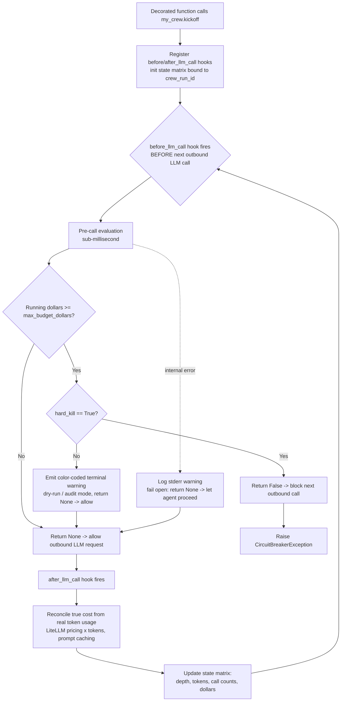

# ARCHITECTURE — agent-breaker

> Index: [`CONTEXT.md`](./CONTEXT.md) · Source of truth: [`claude.md`](./claude.md)
> Related: [`PRD.md`](./PRD.md) · [`ROADMAP.md`](./ROADMAP.md) · [`GLOSSARY.md`](./GLOSSARY.md) · [`CONVENTIONS.md`](./CONVENTIONS.md)

## 1. Design philosophy

agent-breaker is a **pip-installable Python package** that implements a **local, in-memory
execution guard**. It runs *inside* the client application runtime to track, evaluate, and — when
authorized — forcefully terminate runaway workflows. It is a financial utility, not a security
firewall.

## 2. Native SDK, not a network proxy

**We explicitly reject an external API network proxy architecture.** Proxies:

- introduce latency,
- complicate SSL handling,
- break streaming payloads, and
- create an unacceptable single point of failure.

Instead, the tool is a **native Python SDK/wrapper**. All interception happens in-process at
CrewAI's own boundaries — **never** by monkey-patching raw socket connections.

## 3. Developer experience (DX)

Integration wraps the execution loop with a single decorator:

```python
from crew_breaker import crew_circuit_breaker

@crew_circuit_breaker(max_budget_dollars=5.00, hard_kill=True)
def initiate_research_pipeline():
    my_crew = Crew(agents=[...], tasks=[...])
    return my_crew.kickoff()
```

- `max_budget_dollars` — the dollar ceiling for this crew run.
- `hard_kill` — defaults to `False` (passive dry-run/audit). Set `True` to enable deterministic
  termination.

## 4. Core components

### 4.1 Native lifecycle hook injection

Intercept execution at CrewAI's **native LLM call hooks**, not at the socket layer and **not** via
`step_callback`/`task_callback`.

**Why not `step_callback`/`task_callback`:** these fire *after* a step or task has already
completed and only hand you a report of the last action (`AgentAction` / `ToolResult` /
`AgentFinish`). By the time they run, the LLM call — and its cost — has already happened. They can
*observe* spend but cannot *prevent* the next call. Enforcement built on them would always be one
call too late. (This was the riskiest assumption in the original blueprint; it is now resolved —
see `claude.md` §3, VERIFIED.)

**Correct injection points — CrewAI LLM Call Hooks (CrewAI ≥ 1.14):**

- **`before_llm_call`** — runs *before every LLM call*. The pre-call evaluation and the deterministic
  hard-kill bind here. Returning `False` from the hook **blocks that outbound call**; returning
  `None`/`True` allows it. Register via `crewai.hooks.register_before_llm_call_hook(fn)`, the
  `@before_llm_call` decorator, or crew-scoped `@before_llm_call_crew`.
- **`after_llm_call`** — runs *after* the call returns. Used to reconcile true cost from the actual
  token usage on the response.

The hook receives an `LLMCallHookContext` exposing `messages`, `agent`, `task`, `crew`, `llm`, and
`iterations` — enough to attribute cost and depth per agent within the crew run.

```python
from crewai.hooks import register_before_llm_call_hook, register_after_llm_call_hook

def _gate(ctx):                      # before_llm_call
    if running_dollars >= max_budget_dollars and hard_kill:
        raise CircuitBreakerException(...)   # or return False to block silently in dry-run
    return None                      # allow

def _reconcile(ctx):                 # after_llm_call
    accumulate_cost_from(ctx)        # real token usage -> dollars
    return None
```

> **Adapter note:** wrap all hook registration behind a thin internal adapter (see §8) so a change
> to CrewAI's hook signature is absorbed in one place rather than across the codebase.

### 4.2 In-memory state matrix

A lightweight, **thread-safe** local directory that tracks, per active run:

- execution depth,
- token consumption metrics,
- call counts,

all bound to the active `crew_run_id` or thread session. Tracking is **intelligently scoped** to
avoid false positives when the same tool is legitimately called across different sub-tasks (the
Trust Gap — see [`GLOSSARY.md`](./GLOSSARY.md)).

### 4.3 Dynamic cost model parsing

On every iteration, compute true dynamic monetary spend by mapping provider token outputs against
up-to-date pricing schemas, accounting for **prompt caching** differentials where detectable.

**Pricing source — do not hand-roll a table.** A hand-maintained price map goes stale the moment
OpenAI/Anthropic change pricing, and there is no realistic plan to keep it current. Instead, reuse
**LiteLLM's maintained pricing data** — CrewAI already routes model calls through LiteLLM, so it is
effectively a transitive dependency, not new weight:

- Source of truth: LiteLLM's `model_prices_and_context_window.json` (community-maintained; 2,600+
  models). Vendor a pinned snapshot for offline/deterministic use and refresh it on our release
  cadence, **or**
- Call LiteLLM's helpers directly — `litellm.cost_per_token(...)` / `litellm.completion_cost(...)`
  — to get per-call dollar cost from token counts without owning any price map.

This keeps the "pricing goes stale" maintenance burden upstream with LiteLLM instead of on us.
Prompt-caching differentials are read from the same schema (`cache_read_input_token_cost`, etc.)
where the provider reports them.

### 4.4 Evaluation & enforcement modes

- **Dry-run / audit mode (default, `hard_kill=False`)** — passively tracks token velocity and cost,
  emitting color-coded, scannable warnings to the terminal. Never interrupts a run.
- **Deterministic hard-kill (`hard_kill=True`)** — when the running dollar balance breaches the
  ceiling, the middleware **blocks the next outbound network request entirely** and raises a
  structured `CircuitBreakerException`.

**"Next call" semantics & bounded overshoot.** True cost is reconciled in `after_llm_call` (§4.3)
— the only point the real output-token count exists — so the pre-call gate in `before_llm_call`
compares *already-accumulated* spend against the ceiling. The breaker therefore trips on the
**next** call after the ceiling is breached, and total spend can exceed the budget by at most the
cost of the one in-flight call. This is an intentional tradeoff, not a gap:

- Pricing the pending call inside `before_llm_call` would require tokenizing the full message list
  on the blocking path, violating the sub-millisecond pre-call contract (§7).
- Output tokens — usually the bulk of a call's cost — are unknowable until the response returns, so
  a pre-call estimate could only ever price the input side (an imprecise number that still isn't a
  true "block before breach").

For the scenario this tool targets — a runaway loop of many small calls against a budget that is
many multiples of a single call's cost — a one-call overshoot is negligible. Pre-call estimation
is recorded as a possible Phase 2 refinement rather than a v0.1 change.

## 5. Guarded crew run — control flow



## 6. Resilience contract

The breaker must **never** crash a healthy client application. If internal metric tracking fails,
it logs a warning to `stderr` and **gracefully falls back** to letting the agent proceed
("fail open"). See [`CONVENTIONS.md`](./CONVENTIONS.md) for the full quality rules.

## 7. Performance contract

The pre-call evaluation layer must run in **sub-millisecond** execution time. No local embedding
engines and no heavy regex modules that add frame-processing latency.

## 8. Dependency & CrewAI-compatibility contract

CrewAI's API moves fast, and hook/callback signatures have changed across releases. To keep the
breaker from silently breaking on a CrewAI upgrade:

- **Pin the target range:** `crewai>=1.14,<2` (the `before_llm_call`/`after_llm_call` hook API is
  available from 1.14). Record the exact tested version in the lockfile.
- **Adapter isolation:** all CrewAI hook registration and `LLMCallHookContext` field access live
  behind a single thin internal adapter module. If CrewAI changes a hook signature, only the adapter
  changes — the state matrix, cost model, and enforcement logic stay untouched.
- **Compatibility smoke test:** a CI test that registers the hooks against the pinned CrewAI and
  asserts `before_llm_call` can block a call. A breaking change then fails CI instead of a user's
  production run.
- **Minimal dependency surface:** LiteLLM is already transitive via CrewAI (used for pricing data),
  so the breaker adds effectively no new runtime dependencies of its own (stdlib-first).

## 9. Packaging & license

- Distributed on **PyPI** as `agent-breaker`.
- **License: MIT** — deliberately chosen for the open-core model: a maximally permissive core
  maximizes adoption and embedding, with paid/hosted features layered on top. See
  [`CONVENTIONS.md`](./CONVENTIONS.md) §6.
